# Parent gamer

This is a video game planner to avoid overbuying games based on your availability. It lets you build a video game collection and then add play sessions to your calendar, clearly showing you the time you have available each day and how much time is left to play in order to complete games. This will help you identify if you can fit more games in your busy parent schedule.

This application was built using React, Node.js, Express and Axios.

# 💻 Key features

In this section, we will cover the features of the application and how they are expected to be used.

## 🕹️ Home Page

The home page is a simple landing screen allowing you to see what are the next play sessions and you top played games. They also offer links to the core features of the application.

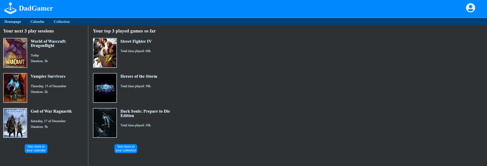

## 🕹️ Game collection

This page allows you to manage your collection. You can browse it fairly easily, edit details, remove or add games to it.

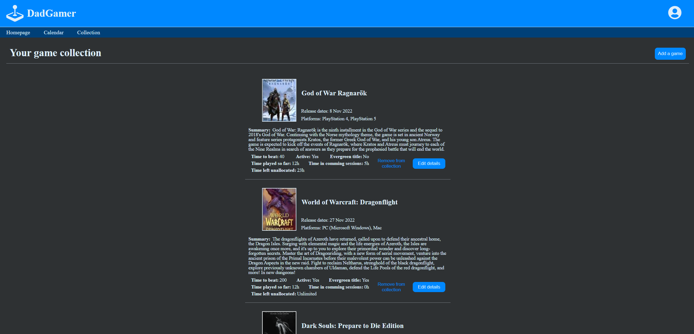

In the collection, clicking edit details will allow you to update the planned time to beat, if it is active (if it will show in the calendar) or flag the game as evergreen. Evergreen titles assume that the games do not have a limited play time and will display differently in both the collection and the calendar features.

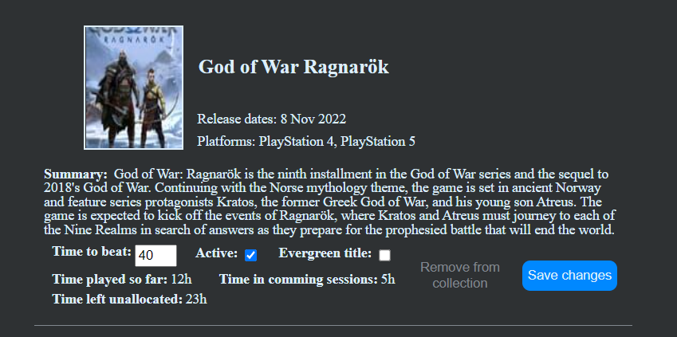

You can also remove games from the collection. It will ask for confirmation before deleting and will display time played so far. It is worth noting that removing the game from the collection would also remove any play session linked to the game being removed.

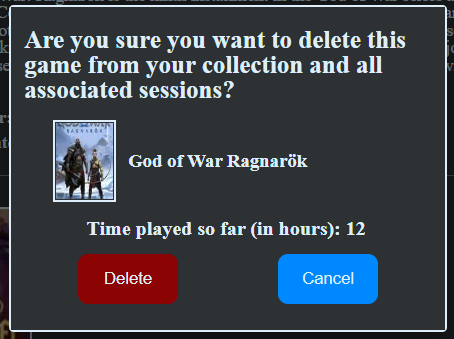

## 🕹️ Adding a game to the collection

Adding a game to the collection is tagged as its own feature, as it will be using the IGDB API to obtain the games mathing the entered title. Because of how it gathers the game, and that is has its own page, it has its own section here. Games already in the collection will be displayed as such and cannot be added again.

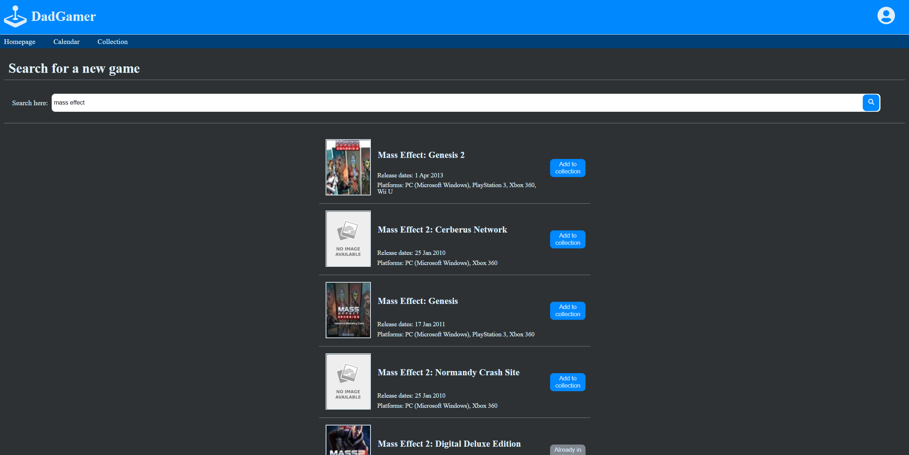

## 🕹️ The calendar

The calendar is the core feature of the application. This is where you will define your play sessions, review and update plans and identify when a game would be finished. There, you will see that in addition to your games, you have the option to increase or decrease availability and the interface will display when you will go over the budgeted hours. Note that in your profile, you can define default availability per day of the week.

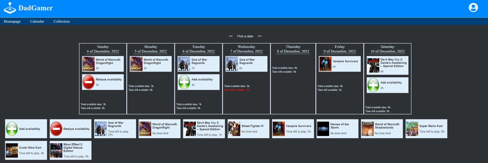

In order to add a play session, you can simply click the game postcard at the bottom and it will open a dialog asking you for the details of the play session you want to add for that week.

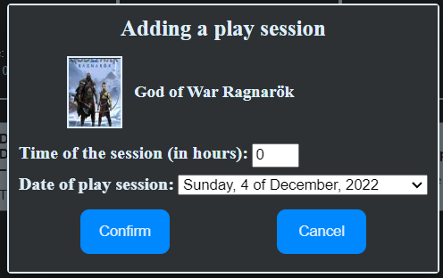

When clicking the postcard that is already in your calendar, a similar window will open, but it will allow you edit or remove a session that alrady exists.

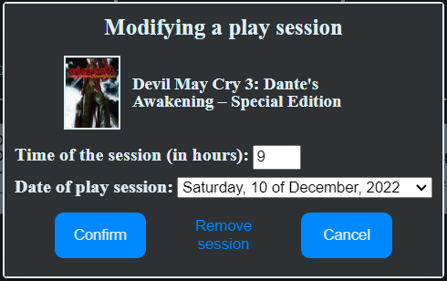

At the top of the page, you also have the week navigation options. There clicking arrows will browse the weeks by increments of 1. To avoid loading the week each time, "Pick a date" can also be clicked and it will open a calendar allowing you to browse the weeks much faster without loading them, and clicking a date will open the week containing that date.

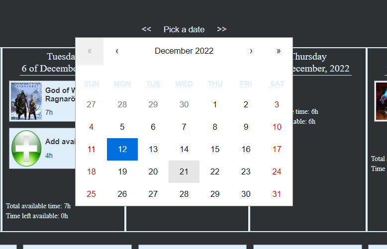

## 🕹️ The profile page

In that page you can update your contact information. The most important section however is about the default availability per day of the week. This will allow you to have the calendar prepopulate availability for each week, greatly simplifying the availability management. The page will display in read mode when first logging in, and update to editable fields when clicking the Edit button.

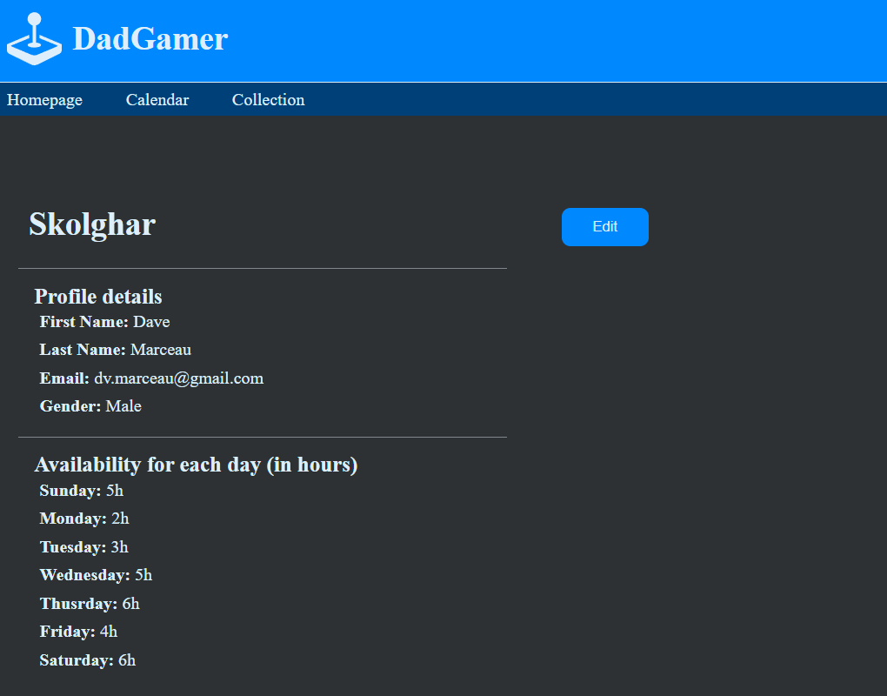

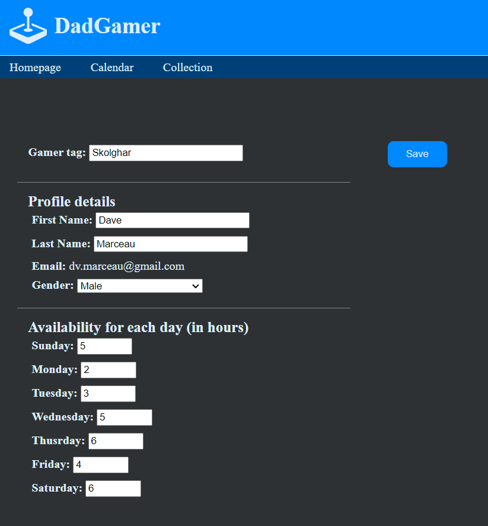

The profile section can be accessed through a dropdown with the logout option.

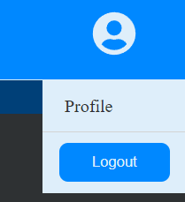

# 💻 Notes on design and libraries

Note that all buttons that would send to the database will disable on click temporarily to prevent sending the same command to the database multiple times. There is a safety in the backend, but this simplifies operation and shows the user work is in progress.

The search feature also does not use the "Apicalypse" that is recommended on the IGDB API. It was not playing nice with Node and it uses Axios behind the scenes anyway, so I bypassed Apicalypse and used Axios directly insteat. The code is available to people curious on how to do the same in their project. The search is quite simple and does not include additionnal filters, but can still be used as a reference.
